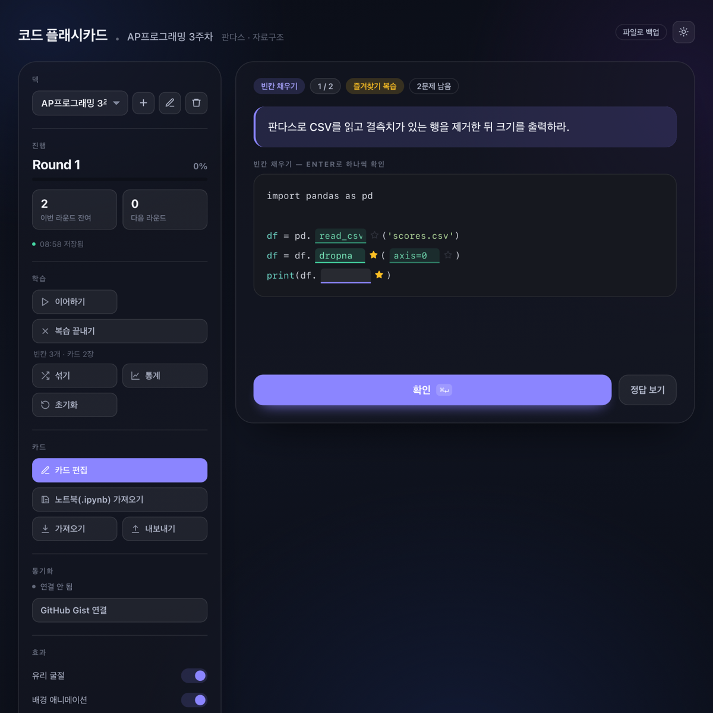

# 코드 플래시카드

코드와 개념을 반복 암기하기 위한 웹 플래시카드 앱입니다. 빌드 과정도 서버도 없이 `index.html` 하나로 동작합니다.

**🔗 바로 사용하기 → https://kyoohan.github.io/code-flashcards/**



## 주요 기능

### 학습
- **두 가지 출제 방식** — 전체 코드를 직접 타이핑하거나, 지정한 일부만 빈칸으로 가려서 출제
- **오답 반복 출제** — 틀린 문제(빈칸 모드는 틀린 빈칸만)를 모아 다음 라운드에 다시 냅니다. 전부 맞힐 때까지 반복
- **빈칸 즐겨찾기** — 자주 틀리는 빈칸에 ★를 달아두고, **그 빈칸만** 모아서 복습. 나머지 빈칸은 채워진 채로 보여 맥락이 유지됩니다
- **학습 통계** — 카드별 정답률과 더 연습이 필요한 카드 목록
- **여러 덱** — 과목·시험별로 카드 세트를 나누고 상단에서 전환

### 카드 만들기
- **드래그로 빈칸 지정** — 코드에서 가리고 싶은 부분을 마우스로 선택한 뒤 `⌘B`(또는 나타나는 버튼)를 누르면 그 범위가 빈칸이 됩니다. 빈칸은 문자열 마커가 아니라 **위치 범위**로 저장되므로, 코드 안에 `{}`나 `{{ }}`가 있어도 전혀 문제가 없습니다.
- **노트북(.ipynb) 가져오기** — Jupyter 노트북을 올리면 마크다운 제목을 기준으로 **섹션이 자동 분리**되어, 마크다운 설명은 문제로 · 코드 셀은 정답으로 짝지어집니다. 섹션 단위/코드 셀 단위를 고를 수 있고, 핵심 토큰(함수명·메서드명 등)을 **자동으로 빈칸 처리**하는 옵션도 있습니다. 문자열과 주석 내부는 빈칸 대상에서 제외됩니다.
- 카드 검색, JSON 내보내기/가져오기
- **기기 간 동기화** — 비공개 GitHub Gist에 모든 덱을 자동 저장·복원

### 화면
- **liquidGL** 기반 유리 굴절 패널과 **WebGPU** 컴퓨트 셰이더로 그리는 배경 파티클. 둘 다 왼쪽 **효과** 패널에서 끄거나 강도를 조절할 수 있습니다.
- WebGPU나 WebGL을 지원하지 않는 환경에서는 각각 정적 배경과 CSS 유리로 자동 폴백합니다.
- 라이트/다크 테마

## 사용 방법

1. 사이트를 열고 왼쪽 **카드 편집**으로 카드를 추가하거나, **노트북(.ipynb) 가져오기**로 수업 노트북을 불러옵니다.
2. 문제를 풀고 **확인**(`⌘↵`)을 누릅니다. 빈칸 모드는 각 빈칸에서 `Enter`로 하나씩 채점합니다.
3. 직접 맞혀서 끝낸 카드는 0.5초 뒤 **자동으로 다음 문제**로 넘어갑니다(`↵`로 바로 넘겨도 됩니다). 틀린 것은 다음 라운드에 다시 나옵니다.
4. 채점기가 틀렸다고 했지만 사실 맞는 답이라면(동치인 코드, 정답 키 오타 등) **정답으로 인정** 버튼을 누르세요. 빈칸 모드는 오답 안내 줄에, 전체 코드 모드는 비교 결과 아래에 있습니다. 통계와 라운드 기록이 정답으로 정정됩니다.
5. 모르겠으면 빈칸을 **비운 채 `Enter`**, 또는 틀린 답을 **고치지 않고 그대로 한 번 더 `Enter`** — 그 칸의 정답이 공개되고 오답으로 기록됩니다. 전체 코드 모드에서는 빈 채로 확인하거나 같은 답을 그대로 다시 확인하면 됩니다. 정답을 공개받은 카드는 읽을 수 있도록 자동으로 넘어가지 않습니다.

진행 상황은 자동 저장되며, 탭을 닫거나 새로고침해도 **풀던 자리에서 그대로 이어집니다.** 처음부터 다시 하려면 **초기화**를 누르세요.

### 즐겨찾기로 약한 부분만 복습하기

빈칸 오른쪽의 흐린 별을 누르면 그 빈칸이 즐겨찾기에 들어갑니다(편집기의 빈칸 칩에서도 가능). 왼쪽 **즐겨찾기만 복습**을 누르면 별표한 빈칸이 있는 카드만, 그 안에서도 **별표한 빈칸만 비워서** 출제합니다. 나머지 빈칸은 정답이 채워진 채로 보이므로 코드 맥락을 잃지 않습니다. **복습 끝내기**로 언제든 일반 학습으로 돌아갑니다.

즐겨찾기는 카드 데이터에 함께 저장되므로 내보내기·Gist 동기화에도 그대로 따라갑니다.

### 빈칸 만들기

모든 빈칸은 **정답 길이와 무관하게 같은 폭**으로 출제됩니다. 칸 크기가 글자 수를 알려주면 힌트가 되기 때문입니다. 폭은 입력한 내용이 길어질 때만 늘어납니다.

정답 코드 입력창에서 가리고 싶은 부분을 **드래그**한 뒤 `⌘B`(Windows는 `Ctrl+B`)를 누르거나, 선택 영역 위에 뜨는 **빈칸으로 지정** 버튼을 클릭하세요. 지정한 빈칸은 아래에 칩으로 표시되며 `×`로 개별 해제할 수 있습니다. 빈칸을 만든 뒤 코드를 수정해도 빈칸 위치는 따라 이동합니다.

편집기는 **자동 저장**됩니다. 빈칸 지정·해제·별표는 즉시, 설명이나 코드 타이핑은 잠깐 멈추면 저장되고, 하단에 저장 시각이 표시됩니다. 새 카드는 설명과 코드가 모두 채워지는 순간 만들어집니다.

## 데이터 저장과 동기화

카드·진행 상황·통계는 기본적으로 브라우저의 `localStorage`에 저장됩니다. 브라우저마다·기기마다 분리되어 있고 사이트 데이터를 지우면 사라지므로, 아래 중 하나로 백업하시길 권합니다.

### 비공개 Gist 동기화 (권장 · 모든 브라우저)

왼쪽 **동기화 → GitHub Gist 연결**에서 GitHub 토큰을 넣으면, 비공개 Gist 하나에 모든 덱이 자동 저장됩니다. 다른 기기에서 같은 토큰을 넣으면 그 Gist를 자동으로 찾아 이어서 쓸 수 있습니다.

- 토큰은 **classic personal access token**에 **`gist` 권한만** 주어 만드세요. ([바로 만들기](https://github.com/settings/tokens/new?scopes=gist&description=code-flashcards%20sync) — 권한이 미리 선택되어 열립니다.) 만료일을 지정해 두시길 권합니다.
- 토큰은 **그 브라우저의 `localStorage`에만** 저장되며, Gist 내용에는 절대 포함되지 않습니다. 다른 방문자는 읽을 수 없습니다.
- 카드를 고치면 몇 초 뒤 자동으로 올라갑니다. 앱을 열 때는 클라우드 쪽을 먼저 받아옵니다.
- 두 기기에서 각각 편집해 어긋나면 어느 쪽을 남길지 물어봅니다.
- 토큰을 지우려면 **연결 해제**를, 완전히 무효화하려면 [GitHub 토큰 설정](https://github.com/settings/tokens)에서 삭제하세요.

> 토큰이 이 페이지에 저장되므로, 외부 CDN이 변조되어 토큰이 유출되는 경로를 없애기 위해 모든 라이브러리를 `vendor/`에 내장해 두었습니다.

### 로컬 파일 백업 (Chrome/Edge 데스크톱)

우측 상단 **파일로 백업**을 누르면 로컬 JSON 파일에 연결되어 변경할 때마다 자동 저장됩니다. 파일을 iCloud Drive나 Dropbox 폴더에 두면 기기 간 동기화로도 쓸 수 있습니다. File System Access API를 쓰므로 **Firefox와 Safari에서는 보이지 않습니다.**

### 수동 백업

**내보내기**로 JSON을 저장하고 **가져오기**로 되돌릴 수 있습니다. 모든 브라우저에서 동작합니다.

**가져오기**를 누르면 붙여넣기 창이 열립니다. AI가 만든 JSON을 그대로 붙여넣으면 되고, ```` ```json ```` 펜스나 앞뒤 설명이 섞여 있어도 알아서 걷어냅니다. 파일을 고르거나 끌어다 놓아도 됩니다.

가져오기 전에 **미리보기**에서 카드마다 설명·코드·빈칸 위치를 확인하고 필요 없는 것은 체크를 해제할 수 있습니다. **기존 카드에 추가**(기본)와 **전부 대체** 중에서 고르세요. AI로 만든 카드 묶음을 조금씩 쌓아 갈 때는 추가를 쓰면 됩니다. 코드에 `{{정답}}` 표시가 있으면 빈칸으로 자동 변환됩니다.

> 사이트(GitHub Pages)와 로컬 파일(`file://`)은 저장 공간이 분리되어 있습니다. 이전에 로컬 HTML 파일로 쓰던 카드가 있다면, 그 파일을 열어 **내보내기** 한 뒤 사이트에서 **가져오기** 하세요. 예전 `{{빈칸}}` 문법으로 만든 카드는 가져올 때 자동으로 새 빈칸 형식으로 변환됩니다.

## 기술

빌드 도구가 없고, 라이브러리는 모두 `vendor/`에 내장되어 있습니다.

| | |
|---|---|
| [liquidGL](https://github.com/naughtyduk/liquidGL) | WebGL 유리 굴절 패널 |
| WebGPU (WGSL) | 배경 파티클 — 컴퓨트 셰이더로 플로우필드 시뮬레이션, 인스턴스 렌더링 |
| [highlight.js](https://highlightjs.org/) | 코드 구문 강조 |
| [jsdiff](https://github.com/kpdecker/jsdiff) | 오답 비교 |
| GitHub Gist API | 기기 간 동기화 |

## 로컬에서 실행

`index.html`을 브라우저로 열기만 하면 됩니다. 정적 서버로 띄우려면:

```bash
python3 -m http.server 8000
```
